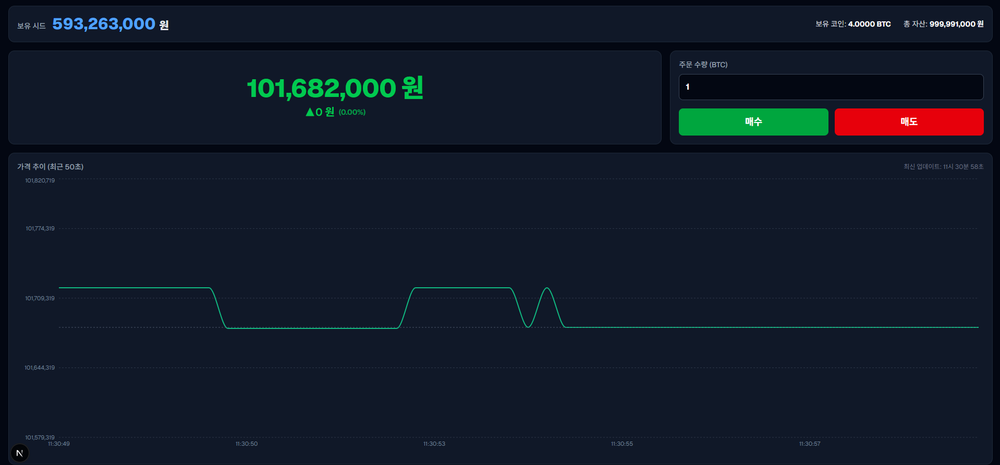

# 🏆 fisa-DanTaKing (단타킹)

> 업비트(Upbit) 실시간 BTC 시세를 기반으로 단타(초단기 매매) 트레이딩을 시뮬레이션하는 웹 애플리케이션

**Spring WebFlux** 기반의 논블로킹 스트리밍 백엔드와 **Next.js** 프론트엔드로 구성된 실시간 암호화폐 트레이딩 시뮬레이터입니다.  
업비트 Public REST API를 **WebClient**로 비동기 폴링하여 `Flux` 스트림으로 변환하고, **SSE (Server-Sent Events)** 를 통해 클라이언트에 실시간 푸시합니다.

---

## 📸 시연 화면



---


## 🏗 아키텍처 개요

```
[Upbit REST API]
      │
      │  WebClient (Non-blocking HTTP)
      ▼
[Spring WebFlux BE]
  Flux.interval(200ms)
      │  flatMap → upbitApiClient.getTickerData()
      │  map      → PriceStreamResponse (등락 계산)
      │  onBackpressureLatest()
      │  replay(1).autoConnect(0)   ← Hot Stream (Multicast)
      │
      │  SSE  text/event-stream
      ▼
[Next.js FE]
  EventSource("/price/stream")
      │  addEventListener("price-quote", ...)
      ▼
  Recharts LineChart (실시간 렌더링)
```

---

## 🛠 기술 스택

### Backend (BE)

| 분류 | 기술 |
|--|--|
| Framework | Spring Boot + **Spring WebFlux** |
| Reactive | Project Reactor (`Flux`, `Mono`) |
| HTTP Client | **WebClient** (Non-blocking) |
| 데이터 소스 | 업비트(Upbit) Public REST API |
| 실시간 통신 | **SSE** (Server-Sent Events) |
| JSON 직렬화 | Jackson (`@JsonProperty`) |

### Frontend (FE)

| 분류 | 기술 |
|--|--|
| Framework | **Next.js 16** (React 19) |
| Language | TypeScript |
| Styling | Tailwind CSS v4 |
| 차트 라이브러리 | **Recharts** |
| 실시간 통신 | **EventSource** (SSE 구독) |

---

## 📡 Backend 핵심 전략: WebFlux 스트리밍 아키텍처

### 1. 업비트 API — WebClient로 Non-blocking 호출 (`UpbitApiClient.java`)

블로킹 방식의 `RestTemplate` 대신 **WebClient**를 사용하여 업비트 REST API를 비동기로 호출합니다.  
업비트 `/v1/ticker` 엔드포인트는 JSON 배열을 반환하므로, `bodyToFlux()`로 역직렬화한 후 `.next()`로 첫 번째 원소만 `Mono`로 추출합니다.

```java
// UpbitApiClient.java
WebClient.builder()
    .baseUrl("https://api.upbit.com")
    .build();

public Mono<UpbitResponse> getTickerData() {
    return webClient.get()
            .uri("/v1/ticker?markets=KRW-BTC")
            .retrieve()
            .bodyToFlux(UpbitResponse.class)  // JSON 배열 → Flux
            .next();                           // 첫 번째 항목만 Mono로
}
```

업비트 응답(`UpbitResponse`)에서 받아오는 필드:

| 필드 | 설명 |
|--|--|
| `trade_price` | 현재 BTC 체결가 (KRW) |
| `change` | 전일 대비 등락 (`RISE` / `FALL` / `EVEN`) |
| `signed_change_price` | 전일 대비 변동 금액 |
| `timestamp` | 체결 시각 (epoch ms) |

---

### 2. Flux 스트림 구성 — Hot Stream으로 Multicast (`PriceService.java`)

`PriceService` 생성 시점에 **단 하나의 Hot Stream**을 만들어, 이후 모든 클라이언트가 이 스트림을 공유(Multicast)합니다.  
업비트를 N명의 구독자마다 각각 호출하는 대신, **1번만 호출**하고 결과를 여러 구독자에게 뿌립니다.

```java
// PriceService.java
this.priceFlux = Flux.interval(Duration.ofMillis(200))  // ① 200ms 마다 tick 발생
        .flatMap(tick -> upbitApiClient.getTickerData()) // ② 업비트 API 비동기 호출
        .map(this::toResponse)                           // ③ 등락 계산 후 DTO 변환
        .onBackpressureLatest()                          // ④ Backpressure 전략
        .replay(1)                                       // ⑤ 신규 구독자에게 최신 1건 즉시 제공
        .autoConnect(0);                                 // ⑥ 구독자 없어도 서버 시작 시 스트림 연결 유지
```

각 연산자의 역할:

| 연산자 | 역할 |
|--|--|
| `Flux.interval(200ms)` | 200ms 마다 이벤트를 발생시켜 폴링 주기를 제어 |
| `flatMap(getTickerData)` | tick마다 업비트 API를 논블로킹으로 호출, 결과를 스트림으로 합성 |
| `map(toResponse)` | 업비트 응답 → 클라이언트 응답 DTO로 변환 (등락/변동폭 계산) |
| `onBackpressureLatest()` | 처리가 밀릴 경우 오래된 데이터는 버리고 **가장 최신 데이터만 유지** |
| `replay(1)` | **Multicast** 전략. 신규 구독자에게 마지막 1건 즉시 전달 → 초기 화면 공백 없음 |
| `autoConnect(0)` | 구독자가 0명이어도 스트림을 자동 시작 → 첫 접속 지연 없음 |

---

### 3. 가격 변동 계산 — AtomicLong으로 스레드 안전 보장 (`PriceService.java`)

WebFlux는 여러 스레드(Reactor 스케줄러)에서 스트림 연산이 병렬로 실행될 수 있습니다.  
이전 가격(previousPrice)과 현재가를 비교하는 상태 유지 로직에 **`AtomicLong`** 을 사용하여 동시성 문제를 방지합니다.

```java
private final AtomicLong previousPrice = new AtomicLong(0);

public PriceStreamResponse toResponse(UpbitResponse upbit) {
    long current  = upbit.tradePrice();
    long previous = previousPrice.getAndSet(current);  // 원자적 읽기+쓰기

    long changePrice = current - previous;
    String change = changePrice >= 0 ? "RISE" : "FALL";

    return new PriceStreamResponse(current, change, changePrice, Instant.now().toString());
}
```

---

### 4. SSE 엔드포인트 — `Flux<ServerSentEvent>` 응답 (`PriceController.java`)

WebSocket이 아닌 **SSE** 를 선택한 이유: 시세 데이터는 **서버 → 클라이언트** 단방향 푸시로 충분하며, SSE는 일반 HTTP 위에서 동작해 인프라 복잡도가 낮습니다.

`produces = MediaType.TEXT_EVENT_STREAM_VALUE` 를 선언하면 Spring WebFlux가 `Flux`를 HTTP 청크(chunk) 단위로 끊어서 클라이언트에 지속적으로 내려보냅니다.

```java
// PriceController.java
@GetMapping(value = "/price/stream", produces = MediaType.TEXT_EVENT_STREAM_VALUE)
public Flux<ServerSentEvent<PriceStreamResponse>> priceStream() {
    return priceService.stream()
            .map(data -> ServerSentEvent.<PriceStreamResponse>builder()
                    .event("price-quote")   // 이벤트 이름 지정
                    .data(data)
                    .build());
}
```

클라이언트가 받는 SSE 데이터 형식:

```
event: price-quote
data: {"price":135800000,"change":"RISE","changePrice":50000,"timestamp":"2026-04-02T02:00:00Z"}
```

---

## 🖥 Frontend 구성 (`page.tsx`)

| 영역 | 설명 |
|--|--|
| **시세 패널** | 현재가, 등락 여부(▲/▼), 변동폭을 실시간으로 표시. 등락에 따라 글자색(초록/빨강) 변경 |
| **주문 패널** | BTC 수량 입력 후 매수/매도. 보유 시드 및 BTC 수량 상태 관리 |
| **차트** | 최근 50건의 가격 데이터를 `Recharts` `LineChart`로 실시간 렌더링. 애니메이션 비활성화로 끊김 없는 갱신 |

### SSE 구독 방식

```typescript
// page.tsx (useEffect)
const eventSource = new EventSource("http://localhost:8080/price/stream");

eventSource.addEventListener("price-quote", (e) => {
    const data: PriceData = JSON.parse(e.data);
    setPriceData(data);                          // 시세 패널 업데이트
    setChartData(prev => [...prev, newEntry].slice(-50)); // 차트 데이터 업데이트 (최대 50건)
});

return () => eventSource.close(); // 컴포넌트 언마운트 시 연결 해제
```

---

## 🚀 전체 데이터 흐름 (End-to-End)

```
① 서버 시작
   └─ PriceService 생성 → autoConnect(0)으로 Hot Stream 즉시 시작

② 200ms 마다 (Flux.interval)
   └─ WebClient로 업비트 /v1/ticker?markets=KRW-BTC 비동기 호출
   └─ UpbitResponse 역직렬화 → PriceStreamResponse 변환 (AtomicLong으로 등락 계산)

③ 클라이언트 접속 (EventSource 연결)
   └─ GET /price/stream 요청
   └─ replay(1): 마지막 캐싱된 시세 1건 즉시 수신 → 화면 즉시 렌더
   └─ 이후 200ms마다 새 이벤트 수신 (SSE 청크 스트리밍)

④ 프론트엔드 렌더링
   └─ price-quote 이벤트 수신 → React state 업데이트
   └─ Recharts LineChart → 최근 50건 가격 추이 실시간 갱신
   └─ 매수/매도 버튼 클릭 → 시드/보유수량 상태 변경
```

---

## ⚙️ 실행 방법

### Backend (BE)

```bash
cd be
./gradlew bootRun
# http://localhost:8080
```

### Frontend (FE)

```bash
cd fe
npm install
npm run dev
# http://localhost:3000
```

> ⚠️ BE를 먼저 실행한 후 FE를 실행해야 SSE 연결이 정상 동작합니다.

---

## 📁 프로젝트 구조

```
fisa-DanTaKing/
├── be/                          # Spring WebFlux 백엔드
│   └── src/main/java/king/danta/fisa/
│       ├── client/
│       │   └── UpbitApiClient.java      # WebClient로 업비트 API 호출
│       ├── config/
│       │   └── WebFluxConfig.java       # CORS 설정
│       ├── controller/
│       │   └── PriceController.java     # SSE 엔드포인트 (/price/stream)
│       ├── dto/
│       │   ├── UpbitResponse.java       # 업비트 API 응답 DTO
│       │   └── PriceStreamResponse.java # 클라이언트 전송 DTO
│       └── service/
│           └── PriceService.java        # Flux 스트림 구성 및 등락 계산
└── fe/                          # Next.js 프론트엔드
    └── app/
        └── page.tsx                     # 대시보드 (SSE 구독 + 차트 + 매매 UI)
```